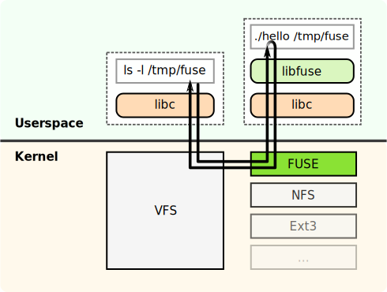

### はじめに
こんにちは。私は今、GSoCに参加して、Gentoo Foundationの元でサンドボックス機構の開発を行っています。[開発はGitHub上のリポジトリ](https://github.com/pluser/fusebox)で行っています。

6月の初めからコードを書き始め、現在はおおよそ３週間が経過しようとしています。この記事では、現在までの成果をまとめると共に、何をどのように開発しているのか説明しようと思っています。

### サンドボックスとは
サンドボックスは、一言で言ってしまうと、セキュリティ機構の一種で、潜在的に危険な操作を実環境とは別の環境で実行し、安全性を担保する仕組みのことを指します。

では具体的に、どのようにサンドボックスは使われているのでしょうか。Gentoo Linux では、パッケージ導入時にビルド処理が走ります。この時、通常のアプリケーションであれば、例えばプログラムのソースファイルにアクセスしたり、システムにインストールされたツールにアクセスしたりするでしょう。しかし、アプリケーションの中には、ビルド中におかしな動作をするものがあります。例えば、システムの設定ファイルを勝手に書き換えるなどです。パッケージシステムにとって、こうした意図しない動作は、システム破壊の元となります。そのため、こうした動作が行われていないかどうか、監視する機構が必要となるのです。

### Fusebox の仕組み
ここでは、現在私が開発しているサンドボックス、「Fusebox」の仕組みについて説明しようと思います。

「Fusebox」は、その名に含まれている技術、「FUSE」を使っています。そのため、「Fusebox」の説明をする前に、「FUSE」の説明をしなければなりません。

#### FUSEとは
「[FUSE](https://ja.wikipedia.org/wiki/Filesystem_in_Userspace)」は「Filesystem in Userspace」を意味する、Linuxや*BSDシステムに組み込まれた機能です。ここでは説明のためにLinuxシステムを前提に説明したいと思います。

ref: https://commons.wikimedia.org/wiki/File:FUSE_structure.svg

通常、ユーザープログラムからのファイルへのI/O命令はVFSという部分を経由して、ファイルシステムドライバへと渡され、そこからさらにハードウェアへと渡されていきます。このメカニズムによってVFSがファイルシステム間の差異を吸収してくれます。そのため、ユーザーランドのプログラムは、ファイルシステムの違いを気にすることなくファイルを読み書きできるわけです。

つまり、ファイルシステムの開発は、VFS向けのインターフェースを作り、抽象化されたハードウェアへどのようにデータを格納するのかをプログラミングすることが本質的な内容です。

ここまで述べたファイルシステムの実装はすべてカーネル空間上で動作します。そのため、実装にもし問題があれば、カーネルパニックを引き起こすなど、システムに深刻な問題を引き起こし、さらにデバッグを困難なものにします。

そこで「FUSE」は、このファイルシステムをユーザーランドの実装で提供できるように考え出されました。VFSを経由してFUSEモジュールがユーザーランドのプログラムに処理を移譲するすることで、このような仕組みは実現できます。

さらにはFUSEを使うことで、仮想のファイルシステムを作ることができます。よくある `/proc` や `/sys` といった、仮想のファイルシステムはもうおなじみでしょう。それらと同じような仮想のファイルシステムを作ることができます。

#### FUSEの応用
さて、ユーザーランドでファイルシステムを実装するFUSEとサンドボックスとは、どのような関係があるのでしょうか。現在の計画では、Fuseboxによって、ルートファイルシステム全体をミラーすることにしています。そしてそのミラーされたファイルシステム（Fusebox）上でビルドなどの潜在的に危険な操作を実行することで、ファイルへのアクセスを監視・管理することができます。

### 現在のFuseboxの状況
では、Fuseboxの現在の実装状況について説明します。

Fuseboxはルートファイルシステムをマウントし、その上に `/sys` や `/dev` などの、`emerge` の動作に必要なファイルシステムをマウントします。続いてそのFuseboxファイルシステム上に `chroot` します。その結果、`emerge --info` や `emerge -p gentoo-source` といったコマンドが実行できるまで実装できました。この実装したファイルシステムではログをとることができ、原則として全てのファイルアクセスを監視できます。

これからしようと考えているのはたくさんありますが、一番重要なものは `emerge` ツールへの組み込みです。`emerge` ツールからシームレスにFuseboxが起動できる必要があります。正直なところ、`emerge` ツールの内部構造について詳細な知識があるわけではないので、これからコードを読んで、どういう実装にするのか考える必要がありそうです。

### 実装上の困難について

ここまでFuseboxを実装していて、一番困った点はinodeをうまく扱うことです。カーネルによるFUSEのAPIからは、アプリケーションからのシステムコールが送られてくるのですが、そこには対象ファイルのinodeしか書かれていないものがあります。実は、`/` `/proc` `/sys` といったファイルシステムのルートinodeは全て1なのです。そのため、これらのファイルシステムがマウントされた状態のツリーをミラーしようとすると、inodeの衝突が起こります。

どのように実装しているかというと、アプリケーションは通常、`open()` などのファイルアクセスに先立って、`lookup()` などのファイル一覧の取得を行ない、パス名からinode番号を取得するためのAPIを呼び出します。その時点で、`/sys`や`/proc`といった特別なパスについては、全く別のinode番号を返答することで、衝突を回避しています。

現在のところ、このプロジェクトでは `pyfuse3` ライブラリを使っています。このライブラリを使っている理由は、広く使われているCライブラリ `libfuse` の開発元と同じであることや、非同期処理によってパフォーマンスが良いと考えられるからです。しかし、この低レベルなライブラリは、カーネルの処理と一対一で結びついているため、システムの振る舞いを詳しく知る必要があり、なかなか大変です。

