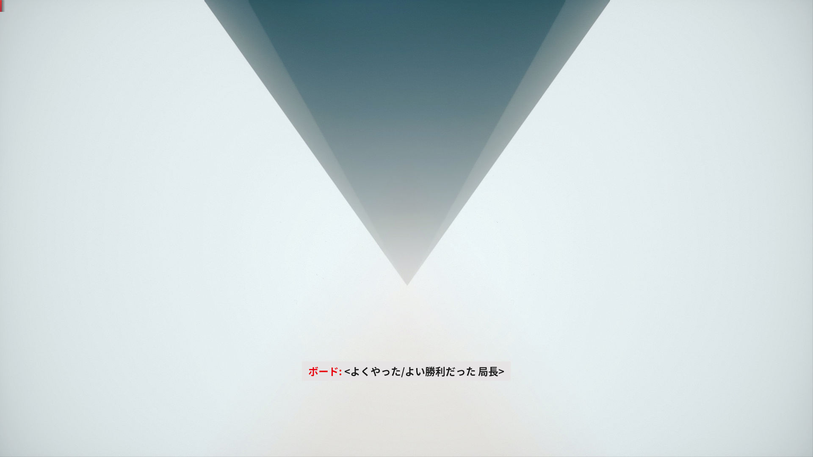

すごく久しぶりにシングルプレイのゲームをクリアしました。Remedy Entertainment / 505 Games から出ている CONTROL というホラーシューティングゲームです。

おおざっぱに内容を書いておくと、アメリカ連邦政府の超常現象揉み消し部隊の局長として、汚染されつつある局内を守る、といった内容のもの。まあ映画 Men in Black の超常現象版だと思えばだいたいあってる。こっちはホラーゲームなのでノリはまったく異なるけれども。

ゲーム Alan Wake とか Quantum break を作った開発スタジオで、どっちもゲームの実況動画で見てて、おもしろそうだと思ってた。XBox Game Pass というゲームサブスクリプションでプレイ可能になってたので、やってみた次第。

以下、プレイしてみた感想。

まず、全体的な演出がかなり映画の表現手法を意識している。新しい場所に来ると、画面を覆いつくさんばかりのデカ文字で場所の名前が出てくる。エンドロールを流して終わりだと思わせて続ける手法とか。

ゲーム中は「オールデスト・ハウス」という建物の中で全ての話が完結するのだが、この建物の中にはさまざまな部屋が存在する。基本的にコンクリート打ちっ放しのブルータリズム建築で、雰囲気を出すのに大きく貢献してる。こんなに建物を良く作ってあるゲームは初めて。アートデザイナー良い仕事するなぁ。

ゲームプレイ的には、なかなか良い感触だった。ファストトラベルもあるし、リスポン地点としてのチェックポイントとは別に細かい粒度で進行フラグが管理されていて、一度フラグを立てさえすればゲームオーバーになっても再度同じことをしなくて良い。

ミッションの進行指示はちょっとだけ分かりにくい。どこへ行けばいいのかなど、ただしミッションの詳細に全て書いてあるので、ミッションの詳細を確認する習慣があれば迷うことはない。

一般的にシューティングゲームはゲーム開始時とかに難易度選択とかすることが多いけれど、このゲームに難易度選択は無い。クリア後に確認したところ、自動難易度調整機能があるらしい。L4Dよろしく敵の強さとか数を自動調整してくれるみたいで、それでも難しいという人には、無敵とか、すべての敵が一撃になるとか、回復量の係数を自分で決められる「アシスト」モードがある。なるほどシューティングしたくない人もストーリーに集中して楽しめそう。

一部の敵がちょっと強すぎるように感じたりもしたけれど、地形を利用したり、ライフ回収時にシールドを張るとかの工夫をするだけで大分楽になった。敵の数や種類も豊富で同時に攻撃してくるので、うまく優先度をつけるとか予備動作を見るとかの工夫をしないと難しめの難易度に感じるかもしれない。要するにちょっと頭を使うシューティングが要求されているゲームだということだ。

後はゲーム中で再生される一部の音楽のデキが良い。普通にCDとか出してるロックバンドと組んで、動的に音楽をシーケンスできるように調整して使っているらしい。ホラーテイストのストーリーテリングが得意な開発スタジオだけれど、この調子でノリノリのシューティングとか作ってもイケるんじゃないかと思ったり。

パズル要素も少しはあるんだけれど難しくはないし、シューティング自体もそれほど難しくはなかった。主人公は超能力を使えるので、空中浮遊したり、物をバンバン投げ飛ばしたり派手なプレイができて楽しい。
一方で物語自体はかなり難解で、SCPと同じく謎は謎のままになっている。

残念な点は翻訳。FBIの連邦捜査局になぞらえてFBCを連邦操作局と訳したところまでは良かった。でも並び替えの order を指令と訳してしまうのはいただけない。他にも一部の会話で男性が突然「ですわ」語尾を使い初めたり… 訳者が悪いというよりも、翻訳のための台本が悪いように見える。会話のコンテキストとかバラバラで翻訳してるんじゃなかろうか。

総じてみると、グラフィックも演出も満足できるゲーム。シューティングも歯応えがある。ただしあくまでもホラーゲームなので、常に嫌な感じの緊張感がある。先へ進みたくない。
あと手元の環境ではちょくちょくゲームが落ちた。まあセーブファイルは破損したりしなかったのでヨシ。
